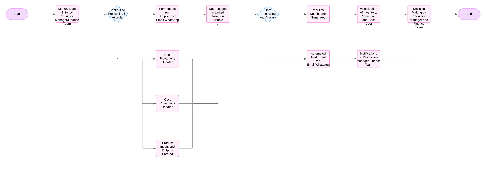
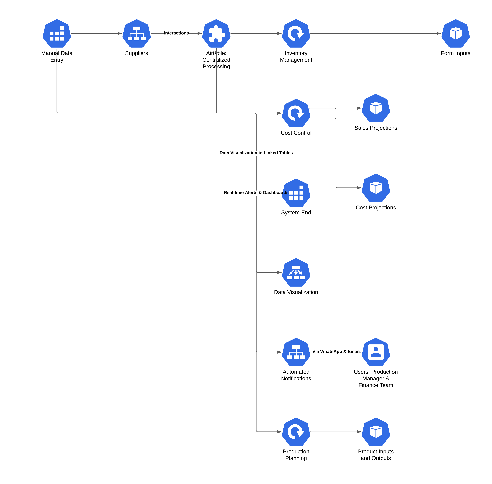
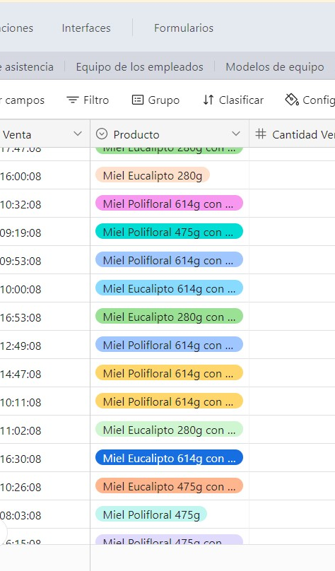
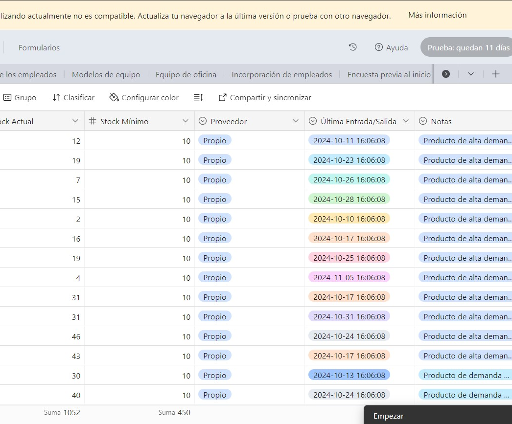
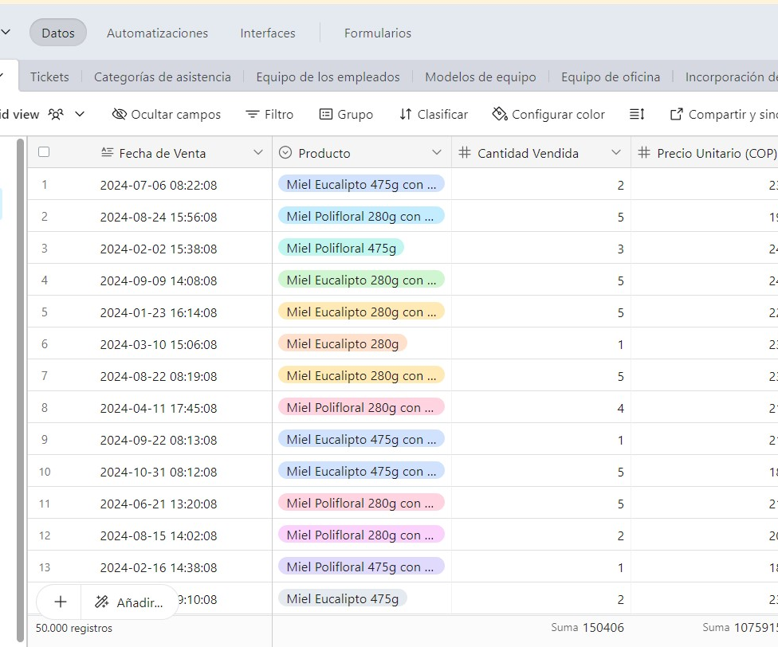
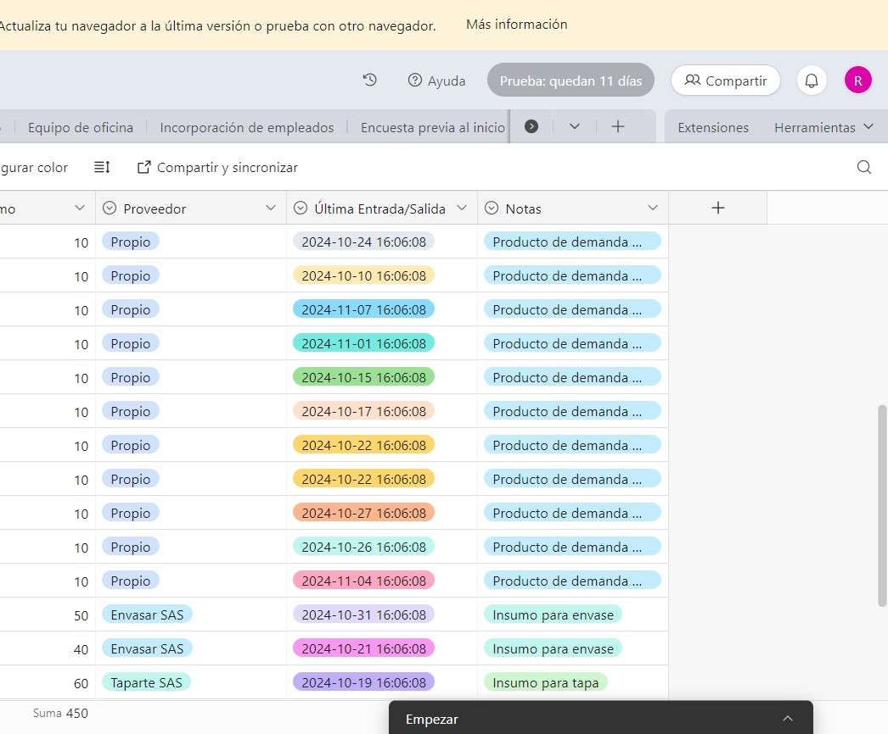
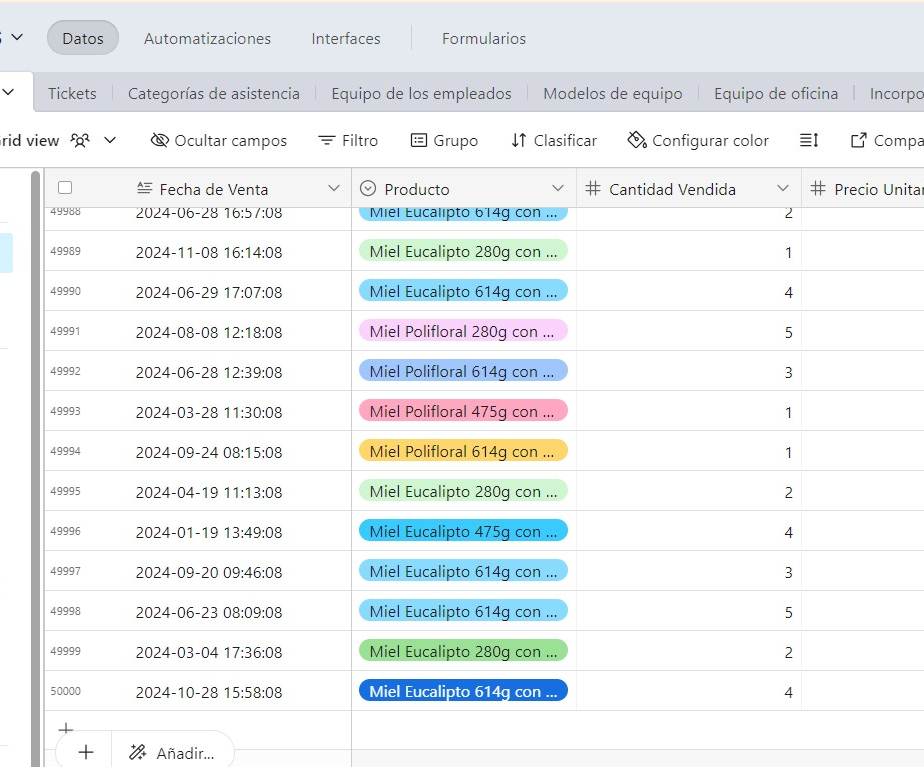
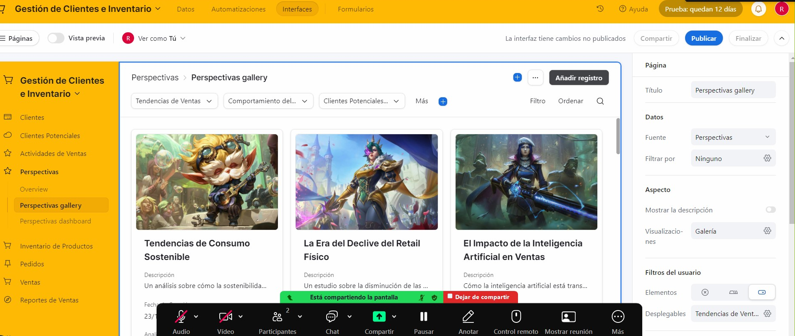
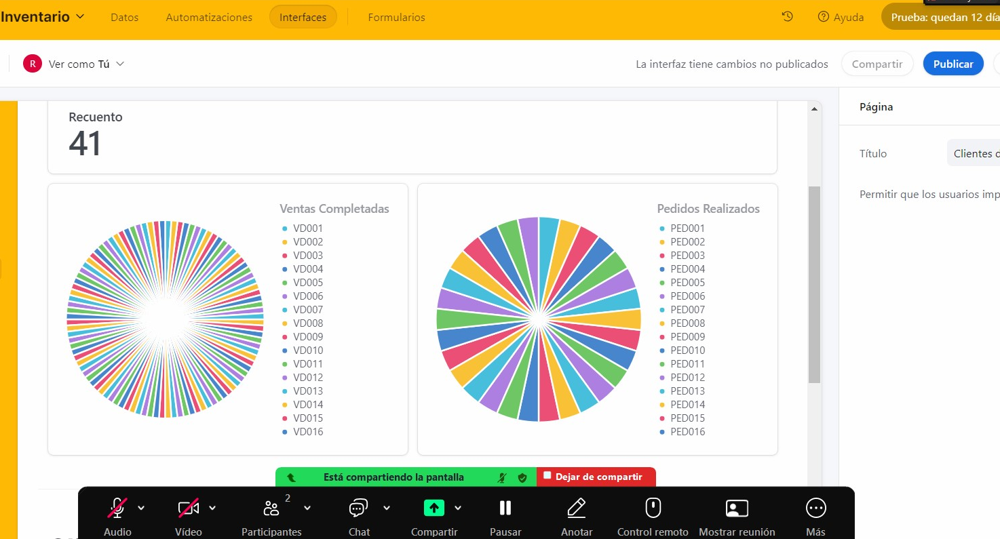
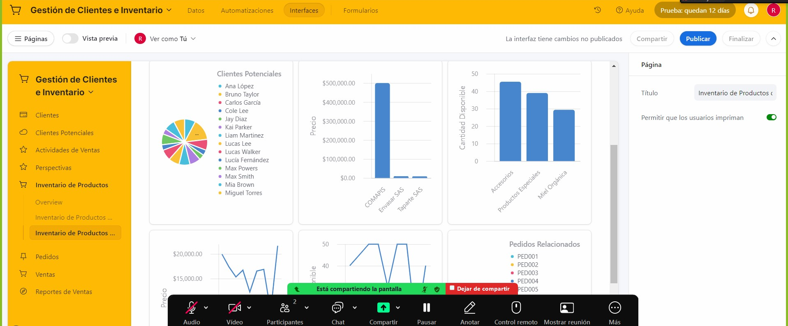

# Operational Optimization Project

This repository presents an operational optimization project developed in collaboration as a consultant and developer, the company preferred to remain anonymous. The project focuses on improving the efficiency and scalability of operational processes through the implementation of customized solutions using Airtable.

## 📋 Description

The main objective was to automate inventory management, production planning, and cost control for a company dedicated to the production and commercialization of multifloral honey and its derivatives. Through an agile approach, a lightweight ERP system was developed to optimize operational times and enhance decision-making accuracy.

## 🛠️ Technologies Used

- **Airtable**: Primary platform for data management and process automation.
- **Communication Tools**: WhatsApp, email, and virtual meetings for coordination with the team and end-users.

## 📈 Key Results

- **40% reduction** in operational times.
- **Increased accuracy** in planning and inventory management.
- **Real-time visibility** through interactive dashboards.
- **Improved operational efficiency** and responsiveness to demand changes.

## 🖼️ Project Images

### Workflow of the Solution

### Superficial Architecture of the Solution

### Image 1

### Image 2

### Image 3

### Image 4

### Image 5

### Image 6

### Image 7

### Image 8

### Image 9

## 🔍 Project Analysis

The company, focused on natural products, faced challenges in manual inventory management and production planning, leading to inefficiencies and errors. Implementing an Airtable-based solution automated these processes, improving accuracy and reducing time spent on repetitive tasks.

## 📊 Methodology and Validation

An agile approach was used, encompassing phases of needs assessment, prototype development, pilot testing, and validation with end-users. The results demonstrated significant improvements in operational efficiency and customer satisfaction.

## 📝 Conclusions

The developed solution has transformed operational processes, allowing the company to scale its operations while maintaining artisanal quality. A full ERP implementation is recommended, incorporating suggested improvements to continue optimizing and growing sustainably.